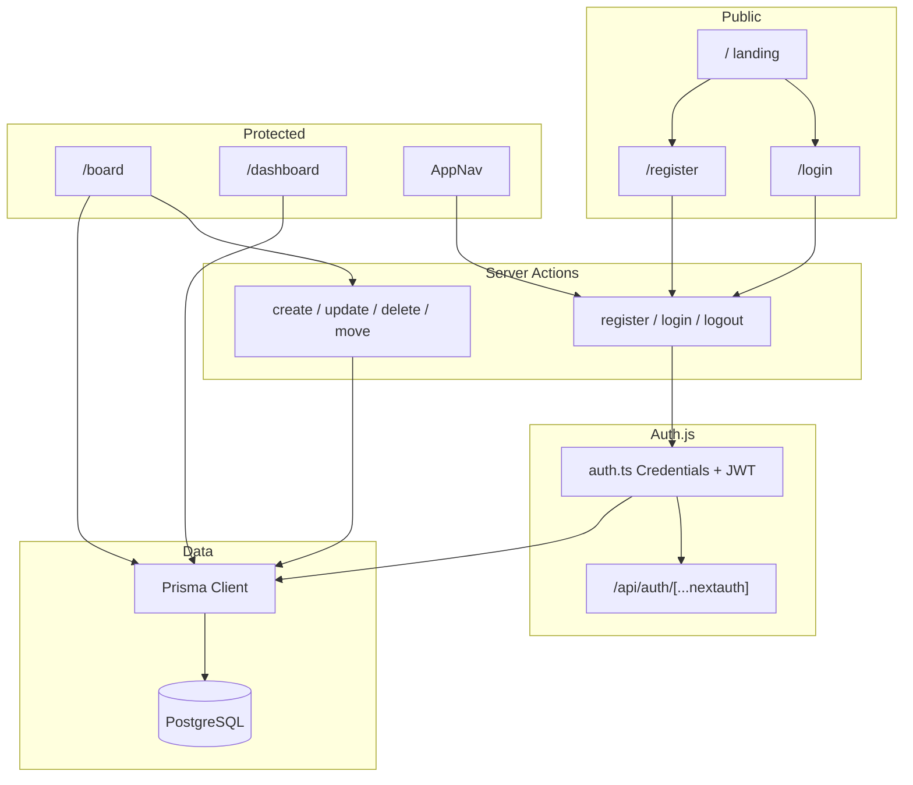
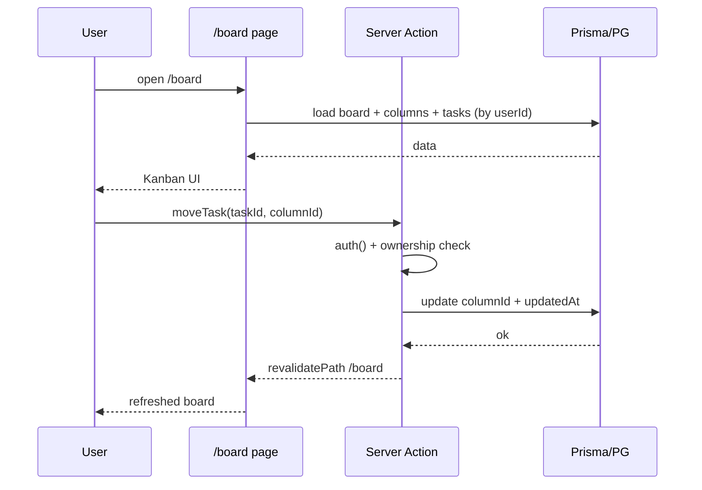

# DevFlow v1 Design

**Spec**: `.specs/features/devflow-v1/spec.md`  
**Context**: `.specs/features/devflow-v1/context.md`  
**Status**: Approved  
**Approach**: A — Auth.js Credentials + JWT, Server Actions, Prisma, `@dnd-kit`

---

## Architecture Overview

Monólito Next.js App Router: UI e mutações no mesmo deploy (Vercel). PostgreSQL no Railway via Prisma. Auth com Auth.js v5 (Credentials + sessão JWT em cookie httpOnly). CRUD/move via Server Actions com checagem de ownership. Board carrega no servidor; filtros no client. Dashboard agrega no servidor.





---

## Code Reuse Analysis

### Existing Components to Leverage

| Component | Location | How to Use |
| --------- | -------- | ---------- |
| Root layout | `src/app/layout.tsx` | Estender com fontes/metadata DevFlow; light mode |
| Home page | `src/app/page.tsx` | Substituir pelo landing (LAND-*) |
| Tailwind v4 | `src/app/globals.css` + PostCSS | Estilos utilitários; sem dark theme |
| Next scaffold | `package.json`, `tsconfig`, `next.config.ts` | Base do app; adicionar deps |

### Integration Points

| System | Integration Method |
| ------ | ------------------ |
| PostgreSQL (Railway) | `DATABASE_URL` via Prisma |
| Vercel | Deploy do app Next; env `DATABASE_URL`, `AUTH_SECRET`, `AUTH_URL` |
| Auth.js | `src/auth.ts` + `src/app/api/auth/[...nextauth]/route.ts` |

---

## Components

### Auth module

- **Purpose**: Login, logout, sessão JWT e guardas de rota.
- **Location**: `src/auth.ts`, `src/app/api/auth/[...nextauth]/route.ts`, `src/lib/auth-guards.ts`
- **Interfaces**:
  - `auth()` — sessão atual (server)
  - `signIn("credentials", …)` / `signOut()` — Auth.js
  - `requireUser(): Promise<{ id: string; email: string }>` — lança redirect para `/login` se ausente
  - `getOwnedTaskOr404(taskId, userId)` — retorna task ou `notFound()`
- **Dependencies**: Auth.js, Prisma, bcryptjs
- **Reuses**: Nenhum (greenfield)

### Register / login actions & pages

- **Purpose**: Cadastro com bootstrap atômico; login com mensagem genérica.
- **Location**: `src/app/(auth)/login/page.tsx`, `src/app/(auth)/register/page.tsx`, `src/app/actions/auth.ts`
- **Interfaces**:
  - `registerAction(formData): Promise<{ ok: true } | { ok: false; fieldErrors }>`
  - `loginAction(formData): Promise<{ ok: true } | { ok: false; formError }>`
  - `logoutAction(): Promise<void>`
- **Dependencies**: Auth module, Prisma transaction, Zod
- **Reuses**: Auth module

**Register transaction (atomic):**

1. Create `User` (email unique, `passwordHash`)
2. Create `Workspace` ("Meu Workspace", `userId`)
3. Create `Board` ("Board Principal", `workspaceId`)
4. Create three `Column` rows: To Do (pos 0), In Progress (1), Done (2)
5. On success → `signIn` credentials → redirect `/board`  
   On duplicate email / validation → field errors; no partial graph

### Board page & Kanban UI

- **Purpose**: Renderizar board, filtros client-side, DnD, abrir modais.
- **Location**: `src/app/(app)/board/page.tsx`, `src/components/board/*`
- **Interfaces**:
  - Server page loads `{ board, columns, tasks }` for `session.user.id`
  - `BoardView` (client): state de filtros + modais; chama task actions
  - `KanbanColumn`, `TaskCard`, `BoardFilters`, `TaskFormModal`, `ConfirmDeleteModal`
- **Dependencies**: `@dnd-kit/core` (+ `pointer` sensor), task actions, Zod schemas shared
- **Reuses**: `Modal` base, `AppNav`

**Filtros (client, AND):** priority exact; tag case-insensitive include; title `includes` case-insensitive. Sem URL sync.

**Ordem na coluna:** `orderBy: { updatedAt: "desc" }` — create/move atualiza `updatedAt` → topo.

### Task server actions

- **Purpose**: Mutações de tarefa com validação e ownership.
- **Location**: `src/app/actions/tasks.ts`
- **Interfaces**:
  - `createTaskAction(input)` → revalidate `/board`, `/dashboard`
  - `updateTaskAction(input)` → idem
  - `deleteTaskAction(taskId)` → idem
  - `moveTaskAction(taskId, columnId)` → idem (também usado pelo DnD)
- **Dependencies**: `requireUser`, Zod (`taskFormSchema`), Prisma
- **Reuses**: Auth guards

**Ownership:** toda query filtra por `task.board.workspace.userId === session.user.id` (ou join equivalente). Miss → `notFound()` (404).

### Dashboard page

- **Purpose**: Métricas do usuário.
- **Location**: `src/app/(app)/dashboard/page.tsx`, `src/components/dashboard/MetricsPanel.tsx`
- **Interfaces**:
  - Server aggregates: count by column name; count by priority; count where column name `"Done"` AND `updatedAt >= now - 7d`
- **Dependencies**: Prisma, `requireUser`
- **Reuses**: `AppNav`

### Landing & shell

- **Purpose**: Marketing mínima + chrome autenticado.
- **Location**: `src/app/page.tsx`, `src/components/AppNav.tsx`, `src/app/(app)/layout.tsx`
- **Interfaces**: Landing CTAs → `/login`, `/register`; `(app)` layout exige auth e renderiza `AppNav` (Board | Dashboard | Logout)
- **Dependencies**: Auth guards
- **Reuses**: Tailwind layout tokens

### Shared UI & validation

- **Purpose**: Modal, inputs, erros inline, toast/banner genérico.
- **Location**: `src/components/ui/*`, `src/lib/validators/task.ts`, `src/lib/validators/auth.ts`, `src/lib/tags.ts`
- **Interfaces**:
  - `Modal` — dialog acessível (focus trap simples, Esc fecha); **nunca** `window.confirm`
  - `dedupeTags(tags: string[]): string[]` — case-insensitive; preserva casing da primeira ocorrência
  - Schemas Zod alinhados aos limites do spec (title 1–120, description ≤2000, tags ≤10 × ≤30, password ≥8)
- **Dependencies**: React, Zod
- **Reuses**: —

### Prisma / DB access

- **Purpose**: Schema, client singleton, migrations.
- **Location**: `prisma/schema.prisma`, `src/lib/prisma.ts`
- **Interfaces**: `prisma` singleton (evitar hot-reload multi-client em dev)
- **Dependencies**: `@prisma/client`, PostgreSQL
- **Reuses**: —

---

## Data Models

### Prisma schema (logical)

```prisma
enum Priority {
  LOW      // baixa
  MEDIUM   // média  — default
  HIGH     // alta
}

model User {
  id           String    @id @default(cuid())
  email        String    @unique
  passwordHash String
  createdAt    DateTime  @default(now())
  updatedAt    DateTime  @updatedAt
  workspace    Workspace?
}

model Workspace {
  id        String   @id @default(cuid())
  name      String
  userId    String   @unique
  user      User     @relation(fields: [userId], references: [id], onDelete: Cascade)
  board     Board?
  createdAt DateTime @default(now())
  updatedAt DateTime @updatedAt
}

model Board {
  id          String     @id @default(cuid())
  name        String
  workspaceId String     @unique
  workspace   Workspace  @relation(fields: [workspaceId], references: [id], onDelete: Cascade)
  columns     Column[]
  tasks       Task[]
  createdAt   DateTime   @default(now())
  updatedAt   DateTime   @updatedAt
}

model Column {
  id        String   @id @default(cuid())
  name      String   // "To Do" | "In Progress" | "Done"
  position  Int      // 0, 1, 2
  boardId   String
  board     Board    @relation(fields: [boardId], references: [id], onDelete: Cascade)
  tasks     Task[]
  createdAt DateTime @default(now())
  updatedAt DateTime @updatedAt

  @@unique([boardId, name])
  @@unique([boardId, position])
}

model Task {
  id          String   @id @default(cuid())
  title       String
  description String   @default("")
  priority    Priority @default(MEDIUM)
  tags        String[] // free-text; deduped in app layer
  boardId     String
  board       Board    @relation(fields: [boardId], references: [id], onDelete: Cascade)
  columnId    String
  column      Column   @relation(fields: [columnId], references: [id], onDelete: Restrict)
  createdAt   DateTime @default(now())
  updatedAt   DateTime @updatedAt

  @@index([boardId])
  @@index([columnId])
  @@index([columnId, updatedAt])
}
```

**Relationships**: User 1—1 Workspace 1—1 Board 1—N Column; Board 1—N Task; Task N—1 Column.

**UI labels:** map `Priority` ↔ `baixa` / `média` / `alta` only in presentation/validation messages.

**Auth.js:** sem Prisma Adapter na v1 (Credentials + JWT). `User` é domínio próprio; não criar tabelas Account/Session do adapter.

### Domain TypeScript (app-facing)

```typescript
type Priority = "LOW" | "MEDIUM" | "HIGH"

interface TaskDTO {
  id: string
  title: string
  description: string
  priority: Priority
  tags: string[]
  columnId: string
  updatedAt: string // ISO
}

interface BoardDTO {
  id: string
  name: string
  columns: { id: string; name: string; position: number; tasks: TaskDTO[] }[]
}

interface DashboardMetrics {
  byStatus: { columnName: string; count: number }[]
  byPriority: { priority: Priority; count: number }[]
  completedLast7Days: number
}
```

---

## Route map

| Route | Auth | Behavior |
| ----- | ---- | -------- |
| `/` | public | Landing |
| `/login` | guest only | Form → `loginAction`; authed → `/board` |
| `/register` | guest only | Form → `registerAction`; authed → `/board` |
| `/board` | required | Kanban |
| `/dashboard` | required | Metrics |
| `/api/auth/[...nextauth]` | Auth.js handlers | Session/CSRF |

`(app)/layout.tsx`: `requireUser()`. Guest layout for auth pages redirects if session exists.

---

## Error Handling Strategy

| Error Scenario | Handling | User Impact |
| -------------- | -------- | ----------- |
| Email duplicado no register | Prisma `P2002` → field error `email` | Inline; conta não criada |
| Senha &lt; 8 / email inválido | Zod no action | Inline nos campos |
| Login inválido | `authorize` null / action | "Email ou senha incorretos" |
| Validação de tarefa | Zod | Inline no modal |
| Task/coluna de outro user | `notFound()` | Página 404 |
| Coluna inexistente no move | `notFound()` ou erro de action | 404 / banner genérico |
| Falha de rede / 500 | try/catch → `{ ok: false }` + log server | Banner "Algo deu errado. Tente de novo." |
| Drop DnD fora da coluna | `@dnd-kit` cancela | Card permanece |
| Sessão inválida/ausente | `requireUser` redirect | `/login` |

---

## Risks & Concerns

| Concern | Location | Impact | Mitigation |
| ------- | -------- | ------ | ---------- |
| Greenfield sem testes | repo inteiro | Regressões sob prazo | Gates por story no Execute; testes focados em validators + actions críticas |
| Credentials + JWT (sem DB session) | `src/auth.ts` | Logout só invalida cookie local | Aceitável v1; documentar; `AUTH_SECRET` forte em prod |
| Password hashing | register/login | Credenciais em risco se fraco | `bcryptjs` cost ≥ 10; nunca logar senha |
| `DATABASE_URL` / secrets | `.env` | Vazamento | `.gitignore`; só `.env.example` com placeholders |
| Cascade delete Board→Tasks | schema | Wipe acidental | Sem UI de delete de board; só task hard-delete |
| Column `onDelete: Restrict` | Task→Column | Migração/delete coluna quebra | Colunas imutáveis na v1 |
| Filtros só no client | `BoardView` | Board grande lento | OK single-user portfólio; server filter se necessário depois |
| Next.js 16 ≠ docs antigas | `AGENTS.md` | APIs erradas | Ler `node_modules/next/dist/docs/` antes de implementar auth/middleware |
| DnD mobile frágil | Kanban | Spec MOVE-04 | Select de coluna no modal de editar |

> Scaffold atual é boilerplate — sem dívida herdada além de substituir `page.tsx`.

---

## Tech Decisions (non-obvious)

| Decision | Choice | Rationale |
| -------- | ------ | --------- |
| Auth library | Auth.js v5 Credentials + **JWT** session | Cookie persistente; Credentials exige JWT; padrão Next/Vercel |
| Prisma Adapter | **Não usar** na v1 | Evita tabelas Account/Session; User próprio + bootstrap custom |
| Mutations | Server Actions + `revalidatePath` | Menos boilerplate que REST para CRUD do mesmo app |
| Tags storage | `String[]` no `Task` | Sem taxonomia; dedupe na app (`dedupeTags`) |
| Column order | `updatedAt desc` only | Spec: sem order fine-grained; topo ao create/move |
| Filters | Client-side AND | Spec: sem URL; payload do board é pequeno |
| DnD | `@dnd-kit/core` | Leve; drop → `moveTaskAction` |
| Modals | Componente próprio | Spec: sem `window.confirm`; create/edit/delete |
| Password hash | `bcryptjs` | Simples em Node/Vercel sem native build pains |
| Priority enum | `LOW`/`MEDIUM`/`HIGH` no DB; labels PT na UI | Schema estável; copy em PT |
| Route groups | `(auth)` / `(app)` | Layouts distintos sem URL segment |

**Project-level (also in `.specs/STATE.md`):** Auth.js JWT credentials; Server Actions as write path; tags as `String[]`.

---

## Testing strategy (for Tasks / Execute)

| Layer | What |
| ----- | ---- |
| Unit | Zod schemas, `dedupeTags`, priority label mappers |
| Integration (actions) | register bootstrap creates 3 columns; ownership → 404; move updates column + `updatedAt`; dashboard 7-day rule |
| Manual / UAT | DnD, custom delete modal, filters AND, empty states |

Gates must assert **spec outcomes**, not implementation details.

---

## Env vars

| Name | Purpose |
| ---- | ------- |
| `DATABASE_URL` | PostgreSQL (Railway) |
| `AUTH_SECRET` | Auth.js JWT encryption |
| `AUTH_URL` | Canonical app URL (prod) |

---

## Requirement coverage (design)

All AUTH-*, BOARD-*, MOVE-*, ISO-*, FILT-*, DASH-*, LAND-* IDs are addressed by the components above. Traceability status moves to **In Design** on approval; task mapping happens in Tasks phase.
